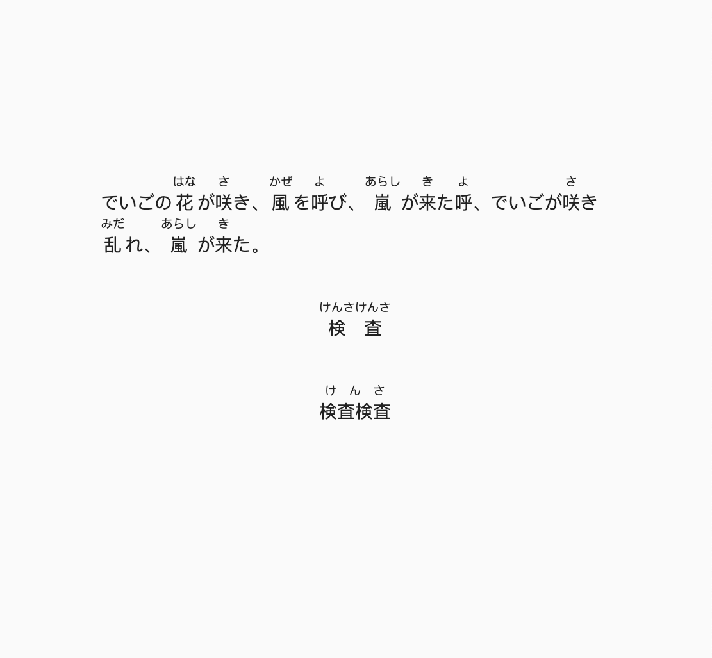

# RubyText

[](https://pub.dartlang.org/packages/ruby_text)

A ruby text widget with flutter.



## Install
```yaml
dependencies:
    ruby_text: <Latest version.>
```

## Example

```dart
  RubyText(
    [
      RubyTextData(
        '検査',
        ruby: 'けんさ',
      ),
    ],
  );
```

## Other

```dart
const RubyText(
  List<RubyTextData> data, {
  double spacing = 0.0,
  TextStyle? style,
  TextStyle? rubyStyle,
  TextAlign? textAlign,
  TextDirection? textDirection,
  bool? softWrap,
  TextOverflow? overflow,
  int? maxLines,
});

const RubyTextData(
  String text, {
  String? ruby, 
  TextStyle? style,
  TextStyle? rubyStyle,
  TextDirection? textDirection,
});

const RubySpanWidget(BuildContext context, RubyTextData data);
```
